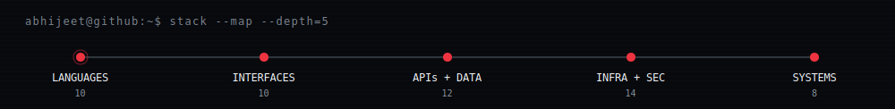
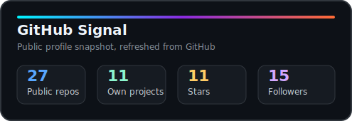
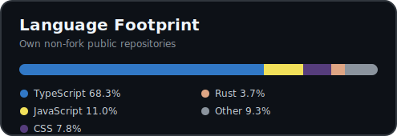

<strong>Building dependable developer tools across AI, infrastructure, real-time systems, and security.</strong>

  
  
  
  
  

  

---

## About

I am **Abhijeet Ranjan**, a full-stack engineer who builds developer-focused software across AI workflows, infrastructure, real-time media, and security. I enjoy taking technically demanding ideas and turning them into products that are clear, dependable, and practical to use.

My work ranges from local-first desktop systems and searchable AI memory to deployment analysis and networking labs. Across those projects, I care about the same fundamentals: thoughtful interfaces, predictable APIs, readable automation, sensible data models, and documentation that helps another engineer move quickly.

I prefer building complete systems over isolated demos: software with a useful workflow, understandable tradeoffs, and enough engineering depth to remain valuable after the first run.

---

## Selected Engineering Work

Four projects that represent the systems, product, and infrastructure work I enjoy most.

01 / REAL-TIME MEDIA / LOCAL-FIRST

### [LensBridge](https://github.com/Abhi190702/lensbridge)

**Local-first phone-to-Windows webcam bridge.** LensBridge pairs through a QR code, streams a phone camera over WebRTC, previews it in a Tauri desktop application, and publishes frames as a Windows DirectShow camera.

**Stack:** Tauri v2, React 19, Rust local services, WebRTC, LAN streaming, Windows DirectShow

[Repository and source](https://github.com/Abhi190702/lensbridge)

 

02 / AI MEMORY / DEVELOPER CONTEXT

### [CTX](https://github.com/Abhi190702/ctx)

**Reusable memory for developer workflows.** CTX turns chats, GitHub context, notes, and project decisions into searchable local-first capsules that can be carried across tools and sessions.

**Stack:** Next.js, SQLite, Prisma, MCP

[Repository and source](https://github.com/Abhi190702/ctx)

 

03 / DEVOPS INTELLIGENCE / ANALYSIS

### [DeploySense](https://github.com/Abhi190702/DeploySense)

**DevOps analysis in engineer-readable language.** DeploySense scans Dockerfiles, Kubernetes manifests, CI/CD workflows, Compose files, and deployment logs, then explains risk and remediation clearly.

**Stack:** TypeScript, Docker, Kubernetes, GitHub Actions

[Repository and source](https://github.com/Abhi190702/DeploySense)

 

04 / NETWORK SECURITY / PRIVACY LAB

### [GhostGate](https://github.com/Abhi190702/GhostGate)

**Hands-on virtual privacy router lab.** GhostGate explores NAT forwarding, DNS logging, firewall rules, Tor routing, and WireGuard through a real Ubuntu VM network setup.

**Stack:** Linux, Bash, Tor, WireGuard

[Repository and source](https://github.com/Abhi190702/GhostGate)

> **Open to collaboration:** local-first software, AI developer tools, CI/CD analysis, virtual devices, automation systems, and security or networking projects.

---

## Technical Toolkit

<strong>Languages</strong> 
C, C++, Java, Rust, JavaScript, TypeScript, Python, Bash, SQL, YAML

<strong>Web and product interfaces</strong> 
React, Next.js, Tauri v2, Vite, Tailwind CSS, Three.js, GSAP, Framer Motion, HTML5, CSS3

<strong>Backend, data, and APIs</strong> 
Node.js, Express, Flask, REST APIs, WebRTC, WebSockets, Prisma, SQLite, PostgreSQL, MySQL, MongoDB, Firebase

<strong>Infrastructure, security, and networking</strong> 
Docker, Docker Compose, Kubernetes, GitHub Actions, Nginx, CI/CD, Vercel, Netlify, Linux CLI, WireGuard, Windows DirectShow, Tor, Wireshark, Nmap

<strong>Core concepts</strong> 
Operating Systems, OOP, DBMS, Computer Networks, Distributed Systems, Monorepos, API Design, MCP

---

## Engineering Profile

**Engineering range.** Full-stack products, AI-native workflows, DevOps automation, GitHub tooling, real-time media bridges, and networking or security labs.

**Build style.** Product-minded interfaces backed by clear APIs, practical data models, useful automation, and readable documentation.

**Public work.** Open Source Contributor with GSSoC 2026 and 18+ Google Cloud Skill Badges across Generative AI, Cloud Run, Compute, Networking, Spanner, APIs, and Automation.

**Direction.** Developer tools that combine local-first media, AI memory, deployment intelligence, security experimentation, and polished product experiences.

---

## GitHub Activity

 

 

Contribution totals appear on the rolling-year map below; the streak card is reserved for streak history.

 

---

## Contribution Map

Rolling-year contribution view generated from GitHub activity.

 

 
 

<h3>Pac-Man eating my contribution graph</h3>

<picture>
  <source media="(prefers-color-scheme: dark)" srcset="https://raw.githubusercontent.com/Abhi190702/Abhi190702/output/pacman-contribution-graph-dark.svg">
  <source media="(prefers-color-scheme: light)" srcset="https://raw.githubusercontent.com/Abhi190702/Abhi190702/output/pacman-contribution-graph.svg">
  
</picture>

---

<strong>Building practical systems with clean interfaces, useful automation, and a little visual character.</strong>

 

<a href="https://abhijeeet.netlify.app/">Portfolio</a> |
<a href="assets/Abhijeet_Ranjan_Resume.pdf">Resume</a> |
<a href="https://www.linkedin.com/in/abhijeet-ranjan-7056ab22a/">LinkedIn</a> |
<a href="https://www.instagram.com/abhi.lonelyfans/">Instagram</a>

