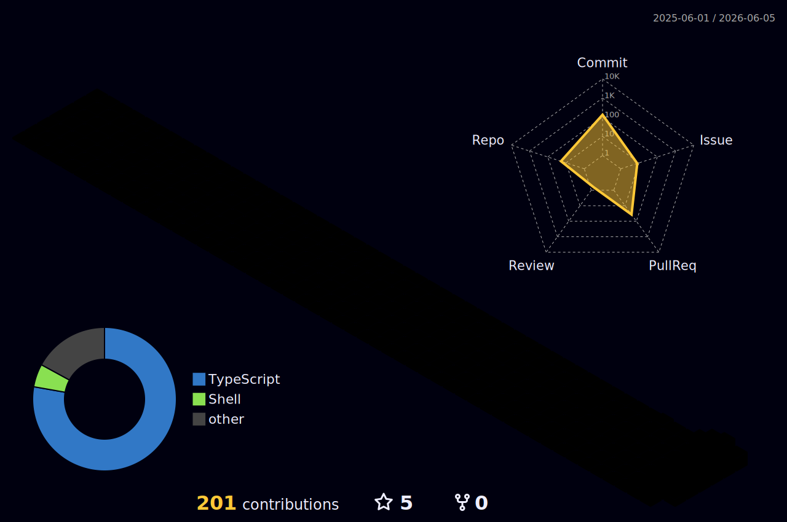

<h3>Full-stack engineering, AI-native tools, DevOps systems, and polished 3D product experiences.</h3>

  
  
  
  
  

  
  
  

---

## About Me

I am **Abhijeet Ranjan**, an Integrated **B.Tech + M.Tech Information Technology** student at **ABV-IIITM Gwalior** with a CGPA of **8.78/10**. I build developer-focused products that combine strong engineering with a polished user experience.

My work sits at the intersection of **full-stack web**, **AI workflows**, **DevOps automation**, **networking/security labs**, and **3D interfaces**. I like projects where the frontend feels sharp, the backend is dependable, and the tooling is useful enough for real developers to keep around.

## Personal Note

I do not just want to make projects that look impressive in a screenshot. I want to build tools that feel reliable after the first click: searchable AI memory, deployment scanners that explain risk clearly, automation that makes developer workflows feel alive, and portfolio experiences that carry personality without losing usability.

---

## Current Focus

- **CTX** - local-first AI memory capsules for chats, GitHub context, notes, and project decisions.
- **DeploySense** - DevOps intelligence for Docker, Kubernetes, GitHub Actions, Compose, and deployment logs.
- **GhostGate** - a virtual privacy router lab with NAT, DNS logging, firewalling, Tor routing, and WireGuard.
- **3D Portfolio** - an interactive web portfolio built with Next.js, Three.js, GSAP, and Framer Motion.

---

## Featured Work

<table>
  <tr>
    <td width="50%">
      <a href="https://github.com/Abhi190702/ctx">
        <h3>CTX</h3>
      </a>
      
A local-first AI memory platform that turns chats, GitHub context, notes, and decisions into reusable searchable capsules.

      

        
        
        
        
      

      

        
      

    </td>
    <td width="50%">
      <a href="https://github.com/Abhi190702/DeploySense">
        <h3>DeploySense</h3>
      </a>
      
Open-source DevOps intelligence for Dockerfiles, Kubernetes manifests, CI/CD workflows, Compose files, and deployment logs.

      

        
        
        
        
      

      

        
      

    </td>
  </tr>
  <tr>
    <td width="50%">
      <a href="https://github.com/Abhi190702/GhostGate">
        <h3>GhostGate</h3>
      </a>
      
A VMware-based Ubuntu router lab for NAT forwarding, DNS resolution/logging, firewalling, Tor routing, and WireGuard privacy experiments.

      

        
        
        
        
      

      

        
      

    </td>
    <td width="50%">
      <a href="https://github.com/Abhi190702/Portfolio">
        <h3>3D Portfolio</h3>
      </a>
      
A polished portfolio with an interactive 3D room, project dashboard, responsive sections, motion, contact flow, and optimized media.

      

        
        
        
        
      

      

        
      

    </td>
  </tr>
  <tr>
    <td colspan="2">
      
        
      <strong>Open to collaboration</strong>
      
Developer tools, AI assistants, GitHub automation, DevOps dashboards, creative frontend systems, and security/networking labs.

    </td>
  </tr>
</table>

---

## Tech Stack

### Languages

  
  
  
  
  
  
  
  
  

### Web And Frontend

  
  
  
  
  
  
  
  

### Backend, Databases And APIs

  
  
  
  
  
  
  
  
  
  

### Cloud, DevOps, Security And Networking

  
  
  
  
  
  
  
  
  
  
  
  
  

### Core Concepts

  
  
  
  
  
  
  
  

---

## Education And Highlights

<table>
  <tr>
    <td width="50%">
      <strong>ABV-IIITM Gwalior</strong> 
      Integrated B.Tech + M.Tech in Information Technology 
      June 2025 - June 2030 
      CGPA: 8.78/10
    </td>
    <td width="50%">
      <strong>Achievements</strong> 
      Open Source Contributor, GSSoC 2026 
      18+ Google Cloud Skill Badges across Generative AI, Cloud Run, Compute, Networking, Spanner, APIs, and Automation
    </td>
  </tr>
</table>

---

## GitHub Activity

 

 

---

## Contribution Map

<picture>
  <source media="(prefers-color-scheme: dark)" srcset="https://raw.githubusercontent.com/Abhi190702/Abhi190702/output/github-contribution-grid-snake-dark.svg" />
  <source media="(prefers-color-scheme: light)" srcset="https://raw.githubusercontent.com/Abhi190702/Abhi190702/output/github-contribution-grid-snake.svg" />
  
</picture>

---

<strong>Building practical systems with clean interfaces, useful automation, and a little visual drama.</strong>

 

<a href="https://abhijeeet.netlify.app/">Portfolio</a> |
<a href="assets/Abhijeet-Ranjan-Resume.pdf">Resume</a> |
<a href="https://www.linkedin.com/in/abhijeet-ranjan-7056ab22a/">LinkedIn</a> |
<a href="https://www.instagram.com/abhi.lonelyfans/">Instagram</a>

